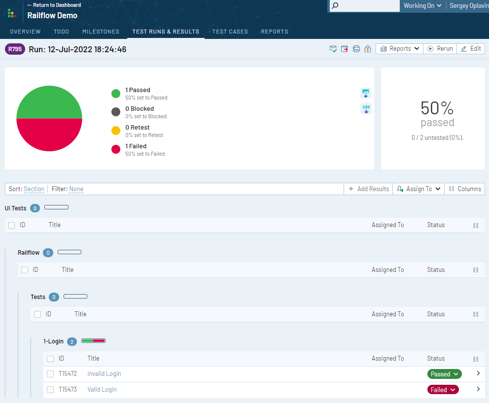
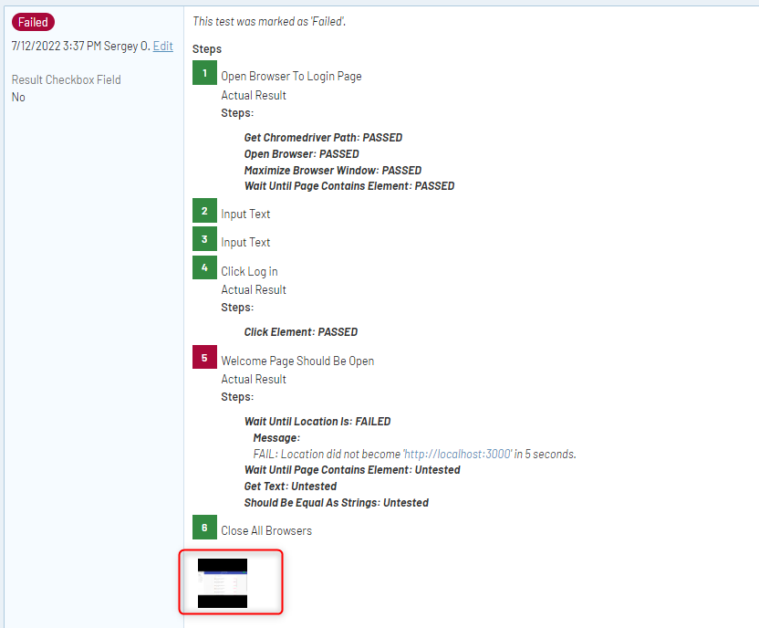

# Robot Framework Example
This simple example illustrates how to connect Robot Framework with TestRail using simple, yet powerful [Railflow NPI CLI](https://www.npmjs.com/package/railflow).

Please refer to the detailed documentation on [our official website](https://docs.railflow.io/docs/robot).  
You can get free 2-week evaluation license [here](https://railflow.io/register).

Repository contains a few Robot tests which uses Selenium for web UI testing.

## Prerequisites
* Robot Framework 4 or newer
* TestRail 7 or newer
* [NodeJS](https://nodejs.org/) 14 or higher with compatible [NPM](https://www.npmjs.com/) version
* [Railflow NPI CLI](https://www.npmjs.com/package/railflow) 2.1.12 or newer

## Installation
```
pip install -r requirements.txt
```

## Run tests
To run test use:

```shell
robot -d results tests/
```

It will run the tests and create reports in `results' folder.

## Installing Railflow NPM Cli
Railflow NPM CLI is an NPM package which provide


```shell
npm install railflow
```

## Uploading Robot test result file into TestRail with Railflow CLI.

```shell
npx railflow -k ABCDE-12345-FGHIJ-67890 -url https://testrail.your-server.com/ -u testrail-username -p testrail-password -pr "Railflow Demo" -path "UI Tests/Railflow" -f robot -r results/output.xml -sm path
```

Where:

| Key                     | Description                                                                                                                                                                                                                                                                                                                                                                                                                                         | Example                                                          |
|-------------------------|-----------------------------------------------------------------------------------------------------------------------------------------------------------------------------------------------------------------------------------------------------------------------------------------------------------------------------------------------------------------------------------------------------------------------------------------------------|------------------------------------------------------------------|
| -k, --key               | (online activation) License key. Can be set with RAILFLOW_LICENSE environment variable                                                                                                                                                                                                                                                                                                                                                              | -k XXXXX-XXXXX-XXXXX-XXXXX                                       |
| -url, --url             | TestRail instance URL                                                                                                                                                                                                                                                                                                                                                                                                                               | -url https://example.testrail.io                                 |
| -u, --username          | TestRail username. Can be set with RAILFLOW_TR_USER environment variable                                                                                                                                                                                                                                                                                                                                                                            | -u test-username                                                 |
| -p, --password          | TestRail password or API Key. Can be set with RAILFLOW_TR_PASSWORD environment variable                                                                                                                                                                                                                                                                                                                                                             | -p XtpHXiPLEODyhF                                                |
| -pr, --project          | TestRail project name                                                                                                                                                                                                                                                                                                                                                                                                                               | -pr "example project"                                            |
| -path, --test-path      | TestRail test cases path                                                                                                                                                                                                                                                                                                                                                                                                                            | -path "Section1/subsection2/ShoppingCart                         |
| -f, --format            | Report format: 'pytest-railflow' (case insensitive)                                                                                                                                                                                                                                                                                                                    | -f junit                                                         |
| -r, --report-files      | The file path(s) to the test report file(s) generated during the build. User can pass multiple values separated with spaces. Ant-style patterns such as **\*\*/reports/\*.xml** can be used.<br/>`E.g. use **target/reports/\*.xml** `to capture all XML files in **target/reports** directory.                                                                                                                            | -r target/surefire-reports/\*.xml target/failsafe-reports/\*.xml |
| -sm, --search-mode      |  Specifies the test case lookup algorithm. <br/> `name:` search for test case matching the name within the entire test suite. If test case found, update the test case. If test case not found, create a new test case within specified `-path` <br/> `path:` search for test case matching the name within the specified `-path`. If test case found, update the test case. If test case not found, create a new test case within specified `-path`| -sm path                                                         |

Please see [Railflow NPM documentation](https://docs.railflow.io/cli/railflow-npm/) for the all the details about Railflow CLI options.

### Test run in TestRail



### Test case results in TestRail

